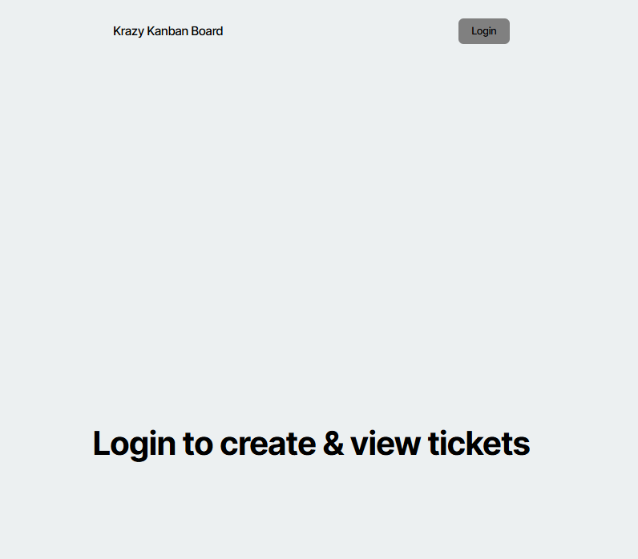
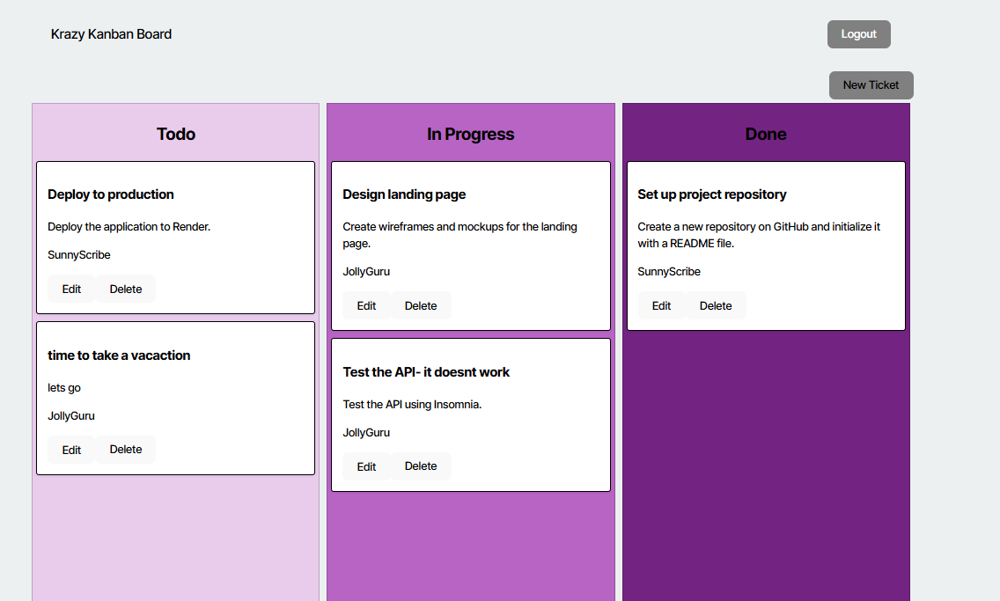
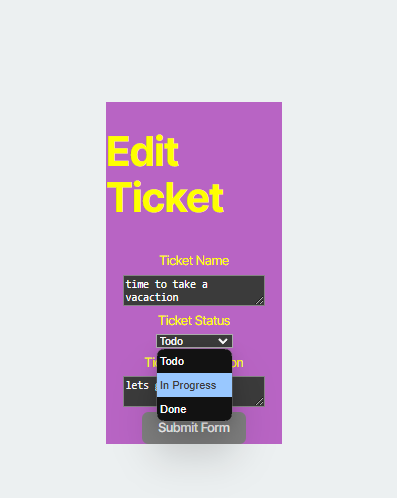
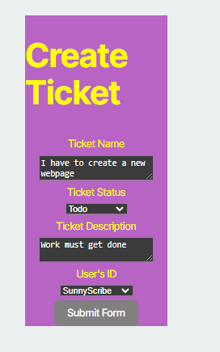

# KanbanBoard

## Table of Contents

- [Description](#description)
- [Design](#design)
- [Install](#install)
- [Contributor](#contributor)
- [License](#license)
- [Questions](#questions)

## Desciption

This application is a Krazy Kanban board. A user isa ble to log int and see a list of tasks: Todo, In Progress or Done. Each task is listed in a column and is easily viewed what the title of the task is, the description and who it is assisned to. Each task is in a card and can be edited or deleted. The user can edit the task and change the task details or they can change from Todo to In Progress or done. Also they can create a new task. 

## Design

This is designed to have a central location to view and add tasks that need to be done. 

<video controls src="assets/walk_through.mp4" title="Title"></video>

 

## Install

npm run start

## Contributor

mvoidets

## License

 This is not licensed.

 ## Questions

 
  If you have any questions, please contact me at: mvoidets@yahoo.com.

 Our GitHub profile is [https://github.com/mvoidets/KanbanBoard](https://github.m/mvoidets/KanbanBoard.com/).

  Thank you for visiting my repository!